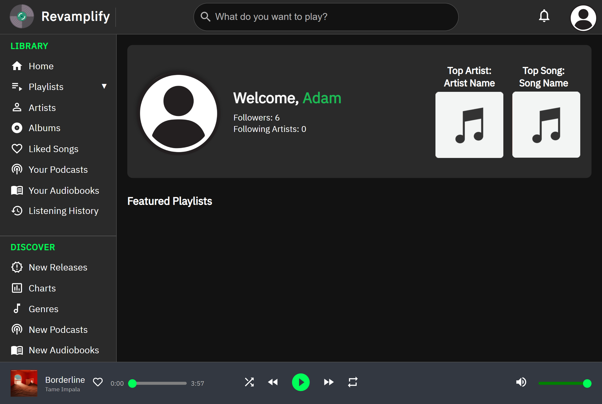

# Revamplify

## Overview

Revamplify is a personal project designed to experiment with user interface (UI) and user experience (UX) concepts. The project aimed to enhance the Spotify Web Player by introducing a modern UI, which works on mobile devices. 

**Important**: This project is currently ***no longer maintained or hosted online***.

## Features

- **Spotify Account Integration**: Users could authenticate via OAuth2 and view their Spotify data, such as playlists, top tracks, and top artists.
- **UI/UX Redesign**: A redesigned interface focused on improving navigation and visual appeal.
- **Music Playback UI**: The UI for music playback was designed but never fully implemented.

### Screenshots

#### Login Page


#### Desktop View


#### Mobile View


## Disclaimer

This project is an independent, personal work and is **not affiliated with or endorsed by Spotify, Inc.** The design and user interface elements used in this project are original and do not incorporate any proprietary assets, trademarks, or logos owned by Spotify, Inc.

The project was intended for personal use only. It should not be considered an official or commercial product. Any resemblance to Spotify’s user interface is purely coincidental and not intended to infringe on any copyrights or trademarks.

This project is provided "as is," without any warranties or guarantees of any kind. Use it at your own risk.

## Installation

If you'd like to explore the code or run it locally, you can follow the instructions below.

### 1. Clone the repository

```bash
git clone https://github.com/your-username/revamplify.git
cd revamplify
```

### 2. Install dependencies
```bash
npm install
```

### 3. Set up environment variables
Create a `.env` file in the root of the project and add the following variables:

- `VITE_DEV_BACKEND_URL`: The URL for your local backend (e.g., `http://localhost:5000`).
- `VITE_PROD_BACKEND_URL`: The URL for your production backend (e.g., `https://your-production-backend.com`).
- `SPOTIFY_CLIENT_ID`: Your Spotify application's **Client ID**. Obtain it from the [Spotify Developer Dashboard](https://developer.spotify.com/dashboard/).
- `SPOTIFY_CLIENT_SECRET`: Your Spotify application's **Client Secret**. Obtain it from the [Spotify Developer Dashboard](https://developer.spotify.com/dashboard/).
- `SPOTIFY_URI`: The **callback URL** for Spotify authentication in development (e.g., `http://localhost:5000/callback`).
- `PROD_SPOTIFY_URI`: The **callback URL** for Spotify authentication in production (e.g., `https://your-production-backend.com/callback`).
- `PROD_FRONTEND_URL`: The URL where your production frontend is hosted (e.g., `https://your-frontend.com`).
- `NODE_ENV`: Defines the environment. Set this to `development` for local development or `production` for production deployments.


### 4. Run the development server
To run the backend and frontend locally, run in seperate terminal instances:

#### Start the backend
```bash
cd backend
node app.js
```

#### Start the frontend
```bash
cd frontend
npm run dev
```
